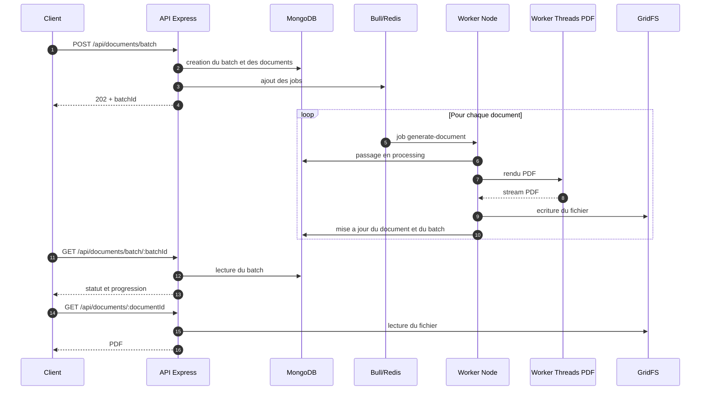

# ProcessIQ Document Service

API Node.js/TypeScript pour la generation asynchrone de documents PDF.

## Objet

Le service permet de :

- creer un batch de documents a partir d'une liste de `userIds`
- suivre l'avancement du batch
- recuperer un PDF genere

Le traitement est fait de maniere asynchrone avec Bull et Redis. Les PDFs sont stockes dans MongoDB avec GridFS.

En local ou en deploiement classique, le projet utilise un worker separe. Pour un deploiement Render gratuit, l'API peut aussi lancer le traitement en mode embarque avec `RUN_EMBEDDED_WORKER=true`.

## Documentation API

- Swagger UI : `GET /docs`
- OpenAPI JSON : `GET /openapi.json`
- Health check : `GET /health`
- Metriques Prometheus : `GET /metrics`
- URL de deploiement : `https://api-generation-documents-kid0.onrender.com/`
- Collection Postman : [postman/ProcessIQ Document Service.postman_collection.json](postman/ProcessIQ%20Document%20Service.postman_collection.json)
- Commandes `curl` : [docs/curl-commands.md](docs/curl-commands.md)

## Endpoints

- `POST /api/documents/batch`
  Cree un batch et ajoute les documents dans la file.
- `GET /api/documents/batch/:batchId`
  Retourne le statut du batch et la liste des documents.
- `GET /api/documents/:documentId`
  Retourne le PDF genere.

Exemple :

```bash
curl -X POST http://localhost:3000/api/documents/batch \
  -H "Content-Type: application/json" \
  -d "{\"userIds\":[\"user-1\",\"user-2\",\"user-3\"]}"
```

## Architecture

Fichiers principaux :

- [src/server.ts](src/server.ts) : demarrage de l'API
- [src/worker.ts](src/worker.ts) : worker Bull
- [src/queues/documentQueue.ts](src/queues/documentQueue.ts) : abstraction de la file Bull / memoire
- [src/lib/pdfWorkerPool.ts](src/lib/pdfWorkerPool.ts) : pool de `worker_threads`
- [src/workers/pdfRender.worker.ts](src/workers/pdfRender.worker.ts) : rendu PDF dans un thread dedie
- [src/services/batchService.ts](src/services/batchService.ts) : creation et suivi des batches
- [src/services/prometheusService.ts](src/services/prometheusService.ts) : metriques Prometheus

### Sequence de traitement



## Choix techniques

### Bull

- gestion simple des jobs asynchrones
- concurrence configurable
- retries avec backoff exponentiel
- possibilite d'executer plusieurs workers separes

### GridFS

- stockage adapte aux fichiers binaires
- lecture et ecriture en streaming
- pas de dependance a un disque local de conteneur
- integration directe avec MongoDB

## Performance et resilience

- rendu PDF via `worker_threads`
- cache des templates
- timeout de rendu a `5s`
- circuit breaker pour l'appel DocuSign simule
- fallback memoire si Redis est indisponible
- reponse en `503` si MongoDB est indisponible
- graceful shutdown sur l'API et le worker

## Securite et qualite

- validation des payloads avec `zod`
- headers HTTP avec `helmet`
- rate limiting global sur `/api`
- rate limiting plus strict sur `POST /api/documents/batch`
- TypeScript en mode `strict`
- ESLint
- tests automatises sur les briques critiques

Commandes utiles :

```bash
npm run lint
npm run test
```

## Observabilite

- logs JSON avec `requestId`, `batchId` et `documentId`
- endpoint Prometheus `GET /metrics`
- endpoint JSON `GET /api/metrics`

Metriques exposees :

- `documents_generated_total`
- `batch_processing_duration_seconds`
- `queue_size`

Fichiers lies :

- [docs/dashboard-observabilite.md](docs/dashboard-observabilite.md)
- [docs/grafana-dashboard.json](docs/grafana-dashboard.json)
- [docs/rapport-performance.md](docs/rapport-performance.md)

## Prerequis

- Node.js 20+
- Docker et Docker Compose

## Installation locale

```bash
npm install
Copy-Item .env.example .env
```

Variables principales :

- `PORT`
- `MONGODB_URI`
- `REDIS_HOST`
- `REDIS_PORT`
- `DOCUMENT_CONCURRENCY`
- `PDF_WORKER_THREADS`
- `PDF_RENDER_TIMEOUT_MS`
- `SHUTDOWN_GRACE_PERIOD_MS`

## Lancement en developpement

Terminal 1 :

```bash
npm run dev
```

Terminal 2 :

```bash
npm run dev:worker
```

Documentation Swagger :

```text
http://localhost:3000/docs
```

## Build et lancement local

```bash
npm run build
npm start
```

Dans un second terminal :

```bash
npm run start:worker
```

## Docker Compose

Fichiers :

- [Dockerfile](Dockerfile)
- [docker-compose.yml](docker-compose.yml)

Lancement :

```bash
Copy-Item .env.example .env
docker compose up --build -d
```

Dans `docker-compose.yml`, `MONGODB_URI` et `REDIS_HOST` sont surcharges pour utiliser `mongo` et `redis` a l'interieur du reseau Docker.

Verification :

```bash
docker compose ps
curl http://localhost:3000/health
curl http://localhost:3000/openapi.json
```

Arret :

```bash
docker compose down
```

Les volumes `mongo-data` et `redis-data` gardent les donnees entre deux lancements.

## Deploiement Render

Le fichier [render.yaml](render.yaml) prepare :

- un service web pour l'API
- une instance Redis

MongoDB doit etre fourni a part, par exemple via MongoDB Atlas, avec `MONGODB_URI`.

Sur Render gratuit, le traitement des jobs tourne dans le meme service que l'API avec `RUN_EMBEDDED_WORKER=true`. Le mode avec worker separe reste disponible en local ou sur une offre qui accepte un background worker.

URL de deploiement :

```text
https://api-generation-documents-kid0.onrender.com/
https://api-generation-documents-kid0.onrender.com/health
https://api-generation-documents-kid0.onrender.com/docs
https://api-generation-documents-kid0.onrender.com/metrics
```

## Benchmark

```bash
npm run benchmark
```

```bash
npm run benchmark:local
```

Le benchmark ecrit ses resultats dans `benchmark-results/<timestamp>/` :

- `samples.json`
- `summary.json`
- `report.md`
- `api.log`
- `worker.log`

## Verification rapide

```bash
curl http://localhost:3000/health
curl http://localhost:3000/metrics
curl http://localhost:3000/openapi.json
```

## Livrables

- [docker-compose.yml](docker-compose.yml)
- [src/scripts/benchmark.ts](src/scripts/benchmark.ts)
- [docs/rapport-performance.md](docs/rapport-performance.md)
- [postman/ProcessIQ Document Service.postman_collection.json](postman/ProcessIQ%20Document%20Service.postman_collection.json)
- [docs/curl-commands.md](docs/curl-commands.md)
- [render.yaml](render.yaml)
- `https://api-generation-documents-kid0.onrender.com/`
